# 校园二手交易平台数据库管理系统大作业报告

## 摘要

随着高校学生闲置物品流转需求的增加，传统微信群、QQ群、朋友圈等非结构化交易方式逐渐暴露出信息检索效率低、交易过程不可追踪、用户信用难以评价、平台数据难以统计等问题。针对上述问题，本项目设计并实现了一个面向校园场景的二手交易平台数据库管理系统。系统以关系数据库为核心，围绕用户、商品、分类、订单、评价、收藏、浏览记录、通知、举报等对象建立数据模型，并在此基础上实现商品发布与检索、订单流转、收藏通知、评价反馈、后台统计、智能商品推荐和智能用户评估等功能。

本系统采用前后端分离结构，前端负责用户交互和系统演示，后端负责业务规则、权限控制和数据访问，数据库负责结构化存储、外码约束、索引优化和统计分析。项目的创新点主要体现在两个方面：
* 基于用户收藏、浏览、下单、类别偏好、价格区间和商品热度构建轻量级智能商品推荐模型，并输出可解释推荐理由；
* 基于订单取消、卖家评价、举报记录、发布行为等指标构建智能用户信用评估模型，为交易风险提示和管理员治理提供依据。系统已准备包含 6 个演示用户、6 个商品分类和 54 个商品的初始化数据，能够支撑完整的课程演示。

关键词：数据库系统；校园二手交易；关系模型；智能推荐；用户信用评估；数据统计

## 1. 项目概述

### 1.1 选题背景

高校学生群体中存在大量低频使用但仍具有价值的闲置物品，例如课程教材、复习资料、数码产品、生活用品、运动器材、交通出行工具等。现实中，这类交易常依赖微信群、QQ群、朋友圈、贴吧或线下熟人介绍完成。此类方式虽然发布门槛较低，但存在明显不足：商品信息分散，买家难以按类别、价格或关键字检索；交易过程缺少统一订单记录，双方责任难以追踪；用户信用主要依赖主观印象，缺少数据化评估；平台运营情况无法通过数据库进行统计分析。

因此，本项目选择“校园二手交易平台”作为数据库管理系统设计主题。该主题具有明确的现实应用背景，也能够较完整地覆盖数据库课程中需求分析、概念结构设计、逻辑结构设计、物理结构设计、数据字典、流程图、系统实现演示和小组协作分工等内容。

### 1.2 项目目标

本项目目标是构建一个工作量适中、业务闭环完整、数据库设计规范的校园二手交易平台。系统需要支持学生用户发布商品、浏览检索商品、收藏商品、创建订单、完成交易、评价反馈；管理员需要能够查看平台统计、处理举报、评估用户信用和维护平台秩序。在此基础上，系统进一步加入智能商品推荐与智能用户评估模块，使项目不仅停留在常规 CRUD 系统层面，而是能够体现数据库行为数据的分析价值。

## 2. 需求分析文档

### 2.1 用户角色分析

系统面向三类主要用户：

- 学生买家：浏览商品、按条件检索商品、收藏商品、提交订单、查看站内通知、评价卖家、举报异常卖家。
- 学生卖家：发布闲置商品、维护商品信息、管理上架和下架状态、处理订单、查看买家购物意向通知。
- 平台管理员：查看后台统计数据、分析用户信用和风险等级、查看举报记录、对异常用户执行拉黑或恢复操作。

### 2.2 功能需求

系统功能需求可归纳为以下七类：

1. 用户认证与个人资料管理：支持用户注册、登录、退出登录、查看个人资料、修改联系方式和个人简介，维护账号状态、认证状态和信誉分。
2. 商品管理：支持商品分类维护、商品发布、商品图片展示、商品编辑、商品下架、商品重新上架和卖家商品列表管理。
3. 商品检索与浏览：支持按关键字、分类、价格区间、发布时间和价格排序检索在售商品，并记录用户浏览行为。
4. 收藏与通知：支持用户收藏商品、取消收藏、查看收藏夹；在订单和账号状态变化时生成站内通知。
5. 订单与评价：支持买家创建订单、卖家确认订单、买家完成订单、双方取消订单；交易完成后支持评价卖家并影响信用分析结果。
6. 数据统计与后台管理：支持热门商品类别排行、活跃用户排行、平台推荐热度、用户信用评估、举报记录查看和用户状态处理。
7. 智能分析功能：支持基于行为数据的商品推荐，以及基于交易、评价和举报数据的用户风险评估。

### 2.3 非功能需求

- 安全性：系统需要对登录状态、管理员权限和用户身份进行校验，防止越权管理他人商品或访问后台页面。
- 一致性：订单状态变化需要与商品状态保持一致，评价和信用分析需要基于真实交易记录。
- 可维护性：数据表命名、字段命名和模块边界保持清晰，便于后续扩展聊天、支付、审核等功能。
- 可扩展性：推荐模块和信用评估模块采用可解释指标组合方式，便于继续加入更多行为特征。
- 可演示性：系统需要具备完整前端界面和初始化数据，能够展示注册登录、商品检索、收藏、下单、通知、后台统计等主要流程。

### 2.4 数据流图

考虑到本系统业务要素较多，数据流图分为一张总图和两张模块子图展示。

#### 2.4.1 系统层总数据流图

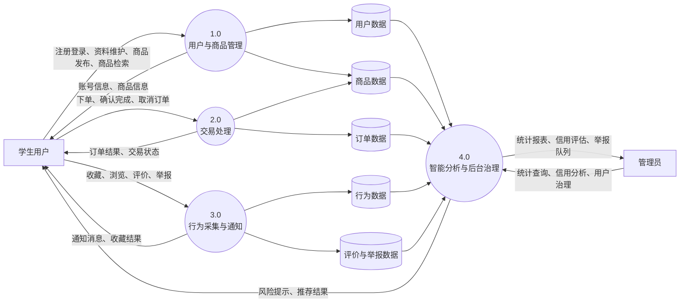
```mermaid
flowchart LR
    User[学生用户]
    Admin[管理员]

    P1((1.0\n用户与商品管理))
    P2((2.0\n交易处理))
    P3((3.0\n行为采集与通知))
    P4((4.0\n智能分析与后台治理))

    D1[("用户数据")]
    D2[("商品数据")]
    D3[("订单数据")]
    D4[("行为数据")]
    D5[("评价与举报数据")]

    User -->|注册登录、资料维护、商品发布、商品检索| P1
    P1 -->|账号信息、商品信息| User
    P1 --> D1
    P1 --> D2

    User -->|下单、确认完成、取消订单| P2
    P2 -->|订单结果、交易状态| User
    P2 --> D3
    P2 --> D2

    User -->|收藏、浏览、评价、举报| P3
    P3 -->|通知消息、收藏结果| User
    P3 --> D4
    P3 --> D5

    Admin -->|统计查询、信用分析、用户治理| P4
    P4 -->|统计报表、信用评估、举报队列| Admin
    P4 -->|风险提示、推荐结果| User
    D1 --> P4
    D2 --> P4
    D3 --> P4
    D4 --> P4
    D5 --> P4
```

#### 2.4.2 商品检索与订单处理数据流图

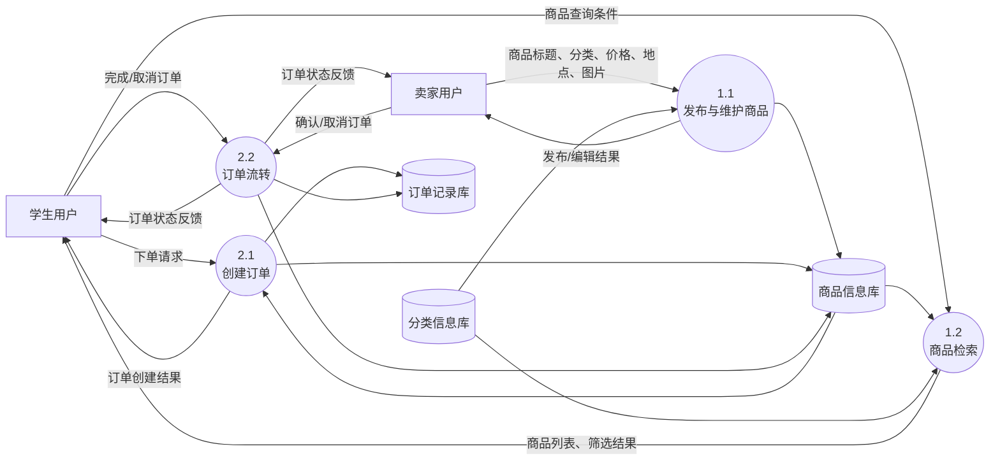
```mermaid
flowchart LR
    User[学生用户]
    Seller[卖家用户]

    P1((1.1\n发布与维护商品))
    P2((1.2\n商品检索))
    P3((2.1\n创建订单))
    P4((2.2\n订单流转))

    D1[("商品信息库")]
    D2[("分类信息库")]
    D3[("订单记录库")]

    User -->|商品查询条件| P2
    P2 -->|商品列表、筛选结果| User
    D1 --> P2
    D2 --> P2

    Seller -->|商品标题、分类、价格、地点、图片| P1
    P1 -->|发布/编辑结果| Seller
    P1 --> D1
    D2 --> P1

    User -->|下单请求| P3
    P3 -->|订单创建结果| User
    D1 --> P3
    P3 --> D3
    P3 --> D1

    Seller -->|确认/取消订单| P4
    User -->|完成/取消订单| P4
    P4 -->|订单状态反馈| Seller
    P4 -->|订单状态反馈| User
    P4 --> D3
    P4 --> D1
```

#### 2.4.3 推荐、信用评估与后台治理数据流图

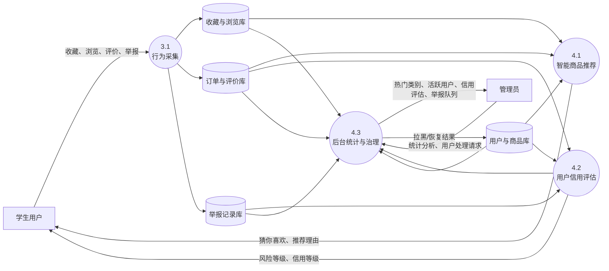
```mermaid
flowchart LR
    User[学生用户]
    Admin[管理员]

    P1((3.1\n行为采集))
    P2((4.1\n智能商品推荐))
    P3((4.2\n用户信用评估))
    P4((4.3\n后台统计与治理))

    D1[("收藏与浏览库")]
    D2[("订单与评价库")]
    D3[("举报记录库")]
    D4[("用户与商品库")]

    User -->|收藏、浏览、评价、举报| P1
    P1 --> D1
    P1 --> D2
    P1 --> D3

    D1 --> P2
    D2 --> P2
    D4 --> P2
    P2 -->|猜你喜欢、推荐理由| User

    D2 --> P3
    D3 --> P3
    D4 --> P3
    P3 -->|风险等级、信用等级| User

    Admin -->|统计分析、用户处理请求| P4
    D1 --> P4
    D2 --> P4
    D3 --> P4
    D4 --> P4
    P3 --> P4
    P4 -->|热门类别、活跃用户、信用评估、举报队列| Admin
    P4 -->|拉黑/恢复结果| D4
```

### 2.5 数据字典

| 数据对象 | 主要字段 | 含义 | 主要约束 |
| --- | --- | --- | --- |
| 用户 user | user_id, student_no, user_name, email, role, credit_score, status | 记录学生和管理员账号信息 | 学号、邮箱唯一；账号状态用于限制交易 |
| 商品分类 category | category_id, category_name, description, status | 记录商品分类信息 | 分类名称唯一；状态控制是否启用 |
| 商品 product | product_id, seller_id, category_id, title, price, status | 记录二手商品基础信息 | 关联卖家和分类；状态区分在售、锁定、已售、下架 |
| 商品图片 product_image | image_id, product_id, image_url, sort_order | 记录商品图片链接 | 商品删除时级联删除图片 |
| 订单 order_info | order_id, product_id, buyer_id, seller_id, order_status, order_amount | 记录交易过程和交易金额 | 关联买家、卖家和商品 |
| 评价 review | review_id, order_id, reviewer_id, reviewed_user_id, score | 记录买家对卖家的评价 | 每个订单最多一条评价；评分范围为 1 至 5 |
| 收藏 favorite | favorite_id, user_id, product_id, create_time | 记录用户收藏行为 | 同一用户不能重复收藏同一商品 |
| 浏览记录 browse_history | history_id, user_id, product_id, browse_time | 记录用户浏览商品行为 | 作为推荐系统行为特征 |
| 通知 notification | notification_id, receiver_id, content, create_time | 记录站内消息 | 通知接收方必须为有效用户 |
| 举报 user_report | report_id, reporter_id, reported_user_id, reason, status | 记录用户举报行为 | 不能举报自己；管理员可据此处理用户 |

## 3. 概念设计文档

### 3.1 实体识别

根据需求分析，本系统抽象出以下核心实体：用户、商品分类、商品、商品图片、订单、评价、收藏、浏览记录、通知和举报。其中，用户既可以是买家，也可以是卖家，还可以是管理员；商品依附于卖家和分类；订单连接买家、卖家和商品；评价基于已完成订单生成；收藏、浏览记录、举报和通知体现用户在平台中的行为轨迹。

### 3.2 E-R 图

由于系统实体和联系较多，若全部绘制在一张图中会导致图面过于拥挤，不利于课程提交、打印阅读与答辩展示。因此，本报告按业务领域将 E-R 图拆分为三个子图，分别展示“用户与商品基础结构”“交易与评价结构”“行为与治理结构”，以提升结构辨识度和阅读清晰度。

#### 3.2.1 用户、商品与分类 E-R 子图

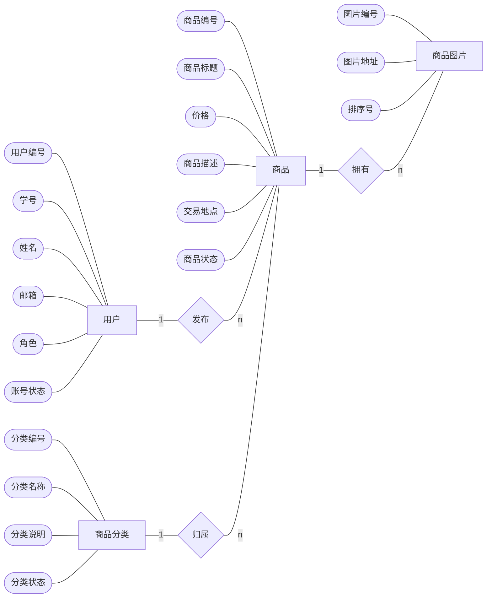
```mermaid
flowchart LR
    User[用户]
    Product[商品]
    Category[商品分类]
    Image[商品图片]

    U_id([用户编号])
    U_no([学号])
    U_name([姓名])
    U_email([邮箱])
    U_role([角色])
    U_status([账号状态])
    U_id --- User
    U_no --- User
    U_name --- User
    U_email --- User
    U_role --- User
    U_status --- User

    C_id([分类编号])
    C_name([分类名称])
    C_desc([分类说明])
    C_status([分类状态])
    C_id --- Category
    C_name --- Category
    C_desc --- Category
    C_status --- Category

    P_id([商品编号])
    P_title([商品标题])
    P_price([价格])
    P_desc([商品描述])
    P_location([交易地点])
    P_status([商品状态])
    P_id --- Product
    P_title --- Product
    P_price --- Product
    P_desc --- Product
    P_location --- Product
    P_status --- Product

    I_id([图片编号])
    I_url([图片地址])
    I_order([排序号])
    I_id --- Image
    I_url --- Image
    I_order --- Image

    RelPublish{发布}
    RelClassify{归属}
    RelImage{拥有}

    User ---|1| RelPublish
    RelPublish ---|n| Product
    Category ---|1| RelClassify
    RelClassify ---|n| Product
    Product ---|1| RelImage
    RelImage ---|n| Image
```

#### 3.2.2 订单与评价 E-R 子图

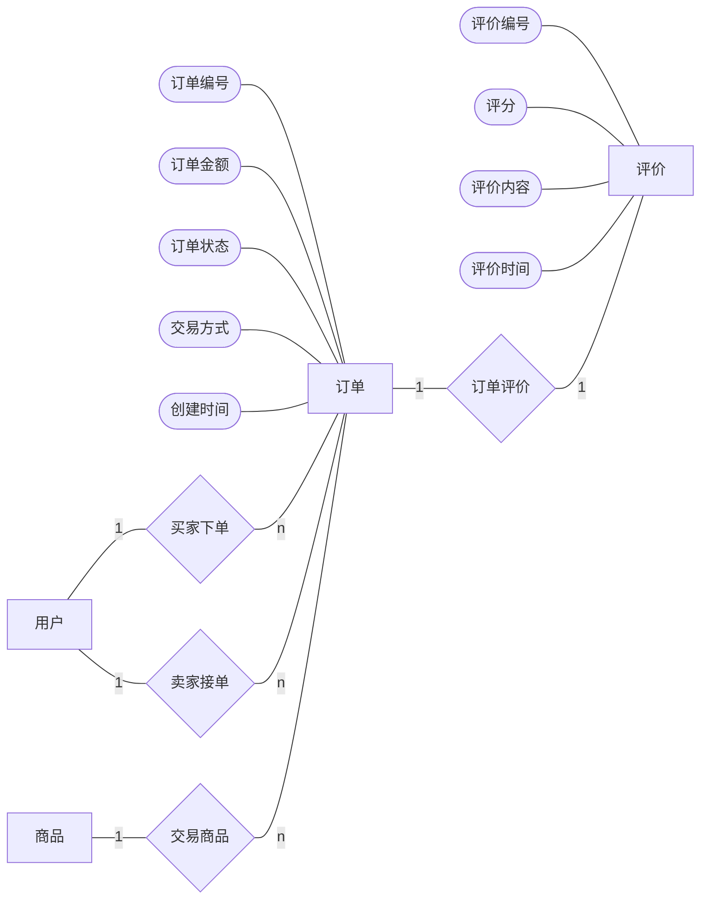
```mermaid
flowchart LR
    User[用户]
    Product[商品]
    Order[订单]
    Review[评价]

    O_id([订单编号])
    O_amount([订单金额])
    O_status([订单状态])
    O_method([交易方式])
    O_time([创建时间])
    O_id --- Order
    O_amount --- Order
    O_status --- Order
    O_method --- Order
    O_time --- Order

    R_id([评价编号])
    R_score([评分])
    R_content([评价内容])
    R_time([评价时间])
    R_id --- Review
    R_score --- Review
    R_content --- Review
    R_time --- Review

    RelBuy{买家下单}
    RelSell{卖家接单}
    RelOrderProduct{交易商品}
    RelReview{订单评价}

    User ---|1| RelBuy
    RelBuy ---|n| Order
    User ---|1| RelSell
    RelSell ---|n| Order
    Product ---|1| RelOrderProduct
    RelOrderProduct ---|n| Order
    Order ---|1| RelReview
    RelReview ---|1| Review
```

#### 3.2.3 收藏、浏览、通知与举报 E-R 子图

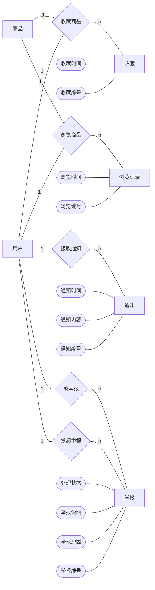
```mermaid
flowchart LR
    User[用户]
    Product[商品]
    Favorite[收藏]
    Browse[浏览记录]
    Notification[通知]
    Report[举报]

    F_id([收藏编号])
    F_time([收藏时间])
    F_id --- Favorite
    F_time --- Favorite

    B_id([浏览编号])
    B_time([浏览时间])
    B_id --- Browse
    B_time --- Browse

    N_id([通知编号])
    N_content([通知内容])
    N_time([通知时间])
    N_id --- Notification
    N_content --- Notification
    N_time --- Notification

    RP_id([举报编号])
    RP_reason([举报原因])
    RP_desc([举报说明])
    RP_status([处理状态])
    RP_id --- Report
    RP_reason --- Report
    RP_desc --- Report
    RP_status --- Report

    RelCollect{收藏商品}
    RelBrowse{浏览商品}
    RelNotify{接收通知}
    RelReportOut{发起举报}
    RelReportIn{被举报}

    User ---|1| RelCollect
    RelCollect ---|n| Favorite
    Product ---|1| RelCollect

    User ---|1| RelBrowse
    RelBrowse ---|n| Browse
    Product ---|1| RelBrowse

    User ---|1| RelNotify
    RelNotify ---|n| Notification

    User ---|1| RelReportOut
    RelReportOut ---|n| Report
    User ---|1| RelReportIn
    RelReportIn ---|n| Report
```

### 3.3 主要实体关系说明

1. 用户与商品之间是一对多关系，一个用户可以发布多个商品。
2. 分类与商品之间是一对多关系，一个分类下可以包含多个商品。
3. 用户与商品之间通过收藏形成多对多关系，该关系由收藏表拆分实现。
4. 用户与商品之间通过浏览记录形成行为关系，用于后续推荐分析。
5. 订单同时关联商品、买家和卖家，构成交易过程的核心业务实体。
6. 评价依赖订单产生，并关联评价者和被评价者。
7. 举报关联举报人和被举报人，管理员可依据举报记录处理异常账号。
8. 通知关联接收用户，用于向用户反馈订单和账号状态变化。

## 4. 逻辑设计文档

### 4.1 E-R 图到关系模型的转换

根据 E-R 模型转换规则，系统将每个强实体转换为一张关系表，将多对多关系拆分为独立关系表，将一对多关系合并到一的一端。转换结果如下：

| 关系模式 | 主码 | 外码 | 说明 |
| --- | --- | --- | --- |
| user(user_id, student_no, user_name, email, role, credit_score, status, ...) | user_id | 无 | 用户账号与身份信息 |
| category(category_id, category_name, description, status, ...) | category_id | 无 | 商品分类信息 |
| product(product_id, seller_id, category_id, title, price, status, ...) | product_id | seller_id, category_id | 商品基础信息 |
| product_image(image_id, product_id, image_url, sort_order) | image_id | product_id | 商品图片信息 |
| order_info(order_id, product_id, buyer_id, seller_id, order_status, order_amount, ...) | order_id | product_id, buyer_id, seller_id | 订单交易信息 |
| review(review_id, order_id, reviewer_id, reviewed_user_id, score, content) | review_id | order_id, reviewer_id, reviewed_user_id | 交易评价信息 |
| favorite(favorite_id, user_id, product_id, create_time) | favorite_id | user_id, product_id | 商品收藏信息 |
| browse_history(history_id, user_id, product_id, browse_time) | history_id | user_id, product_id | 商品浏览行为 |
| notification(notification_id, receiver_id, content, create_time) | notification_id | receiver_id | 站内消息 |
| user_report(report_id, reporter_id, reported_user_id, reason, status) | report_id | reporter_id, reported_user_id | 用户举报记录 |

### 4.2 规范化分析

系统关系模式整体满足第三范式要求。首先，各表字段均保持原子性，例如用户联系方式、商品价格、商品状态分别独立存储，满足第一范式。其次，各表非主属性均依赖于该表主码，例如商品标题、价格和交易地点依赖商品编号，订单金额和订单状态依赖订单编号，满足第二范式。最后，系统尽量避免非主属性之间的传递依赖，例如商品表不直接保存分类名称，而是通过 category_id 关联分类表，从而避免分类改名时出现大量冗余更新问题，满足第三范式。

对于部分业务统计字段，如用户基础信誉分，系统采用直接维护方式，这是出于性能和演示需要的合理冗余。更复杂的信用等级、风险等级和预警原因则通过后台分析实时生成，以减少持久化冗余。

### 4.3 系统结构图

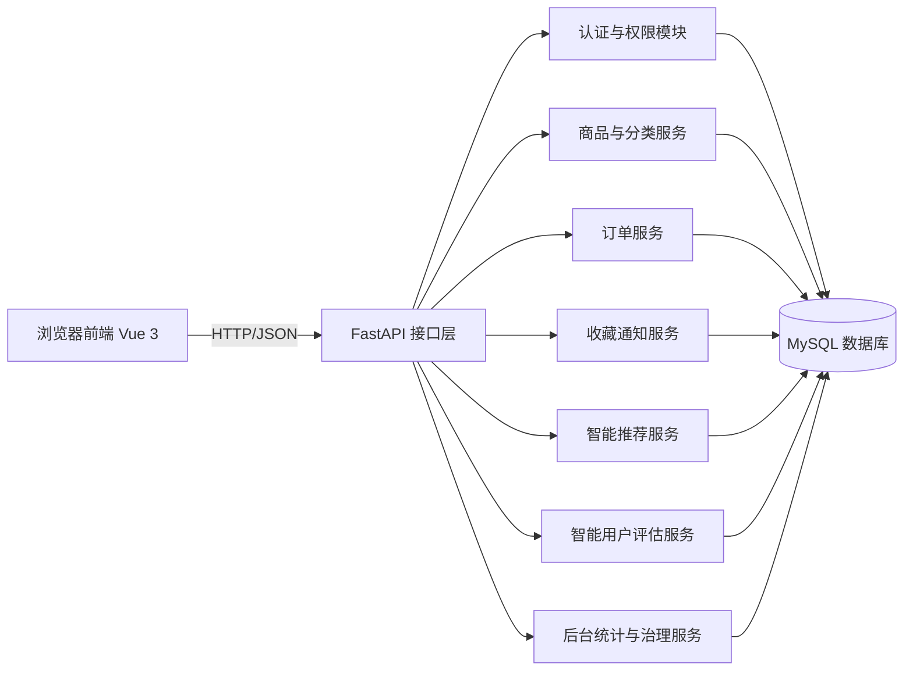
```mermaid
flowchart LR
    Browser[浏览器前端 Vue 3] -->|HTTP/JSON| API[FastAPI 接口层]
    API --> Auth[认证与权限模块]
    API --> Product[商品与分类服务]
    API --> Order[订单服务]
    API --> Social[收藏通知服务]
    API --> Recommend[智能推荐服务]
    API --> Credit[智能用户评估服务]
    API --> Admin[后台统计与治理服务]
    Auth --> DB[(MySQL 数据库)]
    Product --> DB
    Order --> DB
    Social --> DB
    Recommend --> DB
    Credit --> DB
    Admin --> DB
```

### 4.4 业务流程图

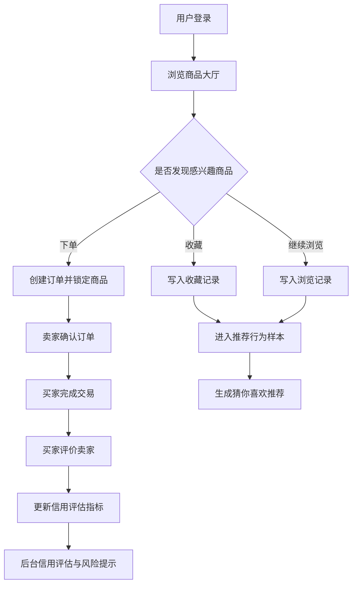
```mermaid
flowchart TD
    A[用户登录] --> B[浏览商品大厅]
    B --> C{是否发现感兴趣商品}
    C -->|收藏| D[写入收藏记录]
    C -->|下单| E[创建订单并锁定商品]
    C -->|继续浏览| F[写入浏览记录]
    D --> G[进入推荐行为样本]
    F --> G
    E --> H[卖家确认订单]
    H --> I[买家完成交易]
    I --> J[买家评价卖家]
    J --> K[更新信用评估指标]
    G --> L[生成猜你喜欢推荐]
    K --> M[后台信用评估与风险提示]
```

## 5. 物理设计文档

### 5.1 存储安排

系统采用 MySQL 8.0 作为主要数据存储，数据库名称为 secondhand。用户、商品、订单、评价、收藏、浏览、通知、举报等业务数据均以关系表形式保存。项目提供初始化脚本，能够在数据库首次启动时自动创建表结构并导入演示数据。演示数据包含 6 个用户、6 个商品分类、54 个商品，以及若干收藏、订单、浏览和通知记录，用于支撑推荐和统计分析。

### 5.2 存储方法选择

系统选择关系型数据库的原因如下：

- 校园交易业务实体之间关系明确，适合使用主码、外码和关系模型表达。
- 订单、评价、收藏、举报等数据对一致性要求较高，关系数据库便于维护约束。
- 商品检索、热门分类、活跃用户、信用评估等功能需要多表连接和聚合统计，MySQL 能够较好支持。
- 数据库课程项目要求展示 E-R 建模、关系模式转换、SQL 查询、索引和事务等能力，关系数据库与课程目标高度一致。

### 5.3 索引设计

| 表名 | 索引字段 | 设计目的 |
| --- | --- | --- |
| user | student_no, email | 支持登录校验并保证账号唯一性 |
| user | status, verify_status | 支持管理员按账号状态筛选 |
| product | seller_id | 支持查询某用户发布的商品 |
| product | category_id, status | 支持商品大厅按分类和在售状态筛选 |
| product | price | 支持价格区间筛选和价格排序 |
| order_info | buyer_id, order_status | 支持买家订单列表查询 |
| order_info | seller_id, order_status | 支持卖家订单列表查询 |
| review | reviewed_user_id | 支持按卖家统计评价均分 |
| favorite | user_id, product_id | 防止重复收藏并支持收藏夹查询 |
| browse_history | user_id, product_id | 支持推荐模块构建用户行为特征 |
| notification | receiver_id | 支持用户查询站内通知 |
| user_report | reported_user_id, status | 支持管理员查看举报队列和用户风险 |

### 5.4 模块 IPO 表

| 模块 | 输入 Input | 处理 Process | 输出 Output |
| --- | --- | --- | --- |
| 用户认证模块 | 学号、邮箱、密码、个人资料 | 校验账号唯一性，验证登录凭证，维护登录状态 | 用户身份信息、访问令牌、个人资料 |
| 商品管理模块 | 商品标题、分类、价格、地点、图片、状态操作 | 校验分类与卖家权限，维护商品状态 | 商品列表、商品详情、卖家商品管理结果 |
| 商品检索模块 | 关键字、分类、价格区间、排序规则 | 按条件筛选在售商品并记录浏览行为 | 商品大厅列表、浏览行为样本 |
| 订单模块 | 商品编号、买家信息、订单操作 | 创建订单，控制订单状态流转，联动商品状态 | 订单列表、订单状态变化结果 |
| 收藏通知模块 | 商品编号、用户行为、通知内容 | 写入收藏记录，生成或读取站内通知 | 收藏夹、通知列表 |
| 评价举报模块 | 评分、评价内容、举报原因 | 写入评价与举报记录，形成信用分析依据 | 评价记录、举报队列 |
| 智能推荐模块 | 收藏、浏览、订单、分类、价格、热度数据 | 计算类别偏好、价格相似度、热门度和协同偏好 | 推荐商品、AI 推荐分、推荐理由 |
| 智能用户评估模块 | 订单取消、卖家评分、举报数、发布数 | 计算信用分、风险等级和预警原因 | 用户信用等级、风险画像、管理员处理依据 |
| 后台统计模块 | 商品、分类、收藏、订单、用户数据 | 聚合统计热门类别、活跃用户和平台热度 | 统计看板、排行榜、运营概览 |

## 6. 系统模块具体说明

### 6.1 用户认证与个人中心模块

用户认证模块负责注册、登录、退出登录和个人资料维护。系统通过学号和邮箱唯一性保证账号可识别，通过角色字段区分普通学生和管理员。个人中心页面展示学号、认证状态、角色、账号状态、信誉分、风险等级、注册时间和最近登录时间，并支持用户维护昵称、手机号、邮箱、性别、头像地址和个人简介。

该模块同时承担用户状态反馈功能。当管理员拉黑用户或系统识别出风险提示时，用户可在个人中心看到账号状态和风险等级。个人中心还聚合展示收藏夹和站内通知，使用户能够集中查看交易动态。

### 6.2 商品管理与检索模块

商品管理模块支持卖家发布、编辑、下架和重新上架商品。商品表通过 category_id 与分类表关联，避免直接在商品表中存储分类名称造成冗余。商品大厅支持关键字搜索、分类筛选、最低价格和最高价格筛选、发布时间排序和价格排序，能够满足买家快速定位目标商品的需求。

系统还提供商品图片展示和交易地点字段，使商品信息更符合校园线下交易场景。商品大厅展示当前在售商品数量，演示数据中商品总数为 54 件，覆盖教材资料、数码产品、生活用品、运动户外、美妆个护、交通出行等多个类别。

### 6.3 订单与评价模块

订单模块围绕二手交易过程设计，支持买家创建订单、卖家确认订单、买家完成交易和双方取消订单。订单状态与商品状态联动，例如买家下单后商品进入锁定状态，订单完成后商品进入已售状态。该设计能够避免多个买家同时购买同一商品造成的数据冲突。

评价模块依赖已完成订单产生。买家完成交易后可以对卖家进行评分和文字评价，评价结果进一步参与用户信用评估。通过订单和评价的关联，系统能够将交易过程、商品状态和用户信誉统一纳入数据库管理。

### 6.4 收藏、浏览与站内通知模块

收藏模块支持用户收藏商品、取消收藏和查看收藏夹。系统限制用户不能收藏自己发布的商品，也避免同一用户重复收藏同一商品。收藏行为既服务于用户个人收藏夹，也作为推荐算法的重要行为样本。

浏览记录模块在用户进入商品大厅并加载商品列表时记录可见商品，为智能推荐提供轻量行为数据。站内通知模块用于传递订单相关消息和管理员处理结果，例如买家下单提醒、卖家确认订单提醒、账号被拉黑提醒等。通过收藏、浏览和通知三类行为数据，系统能够形成较完整的用户交互链路。

### 6.5 智能商品推荐模块

智能商品推荐是本项目的重点创新点之一。系统不是简单按发布时间展示商品，而是综合用户收藏记录、浏览偏好、下单行为、商品类别偏好、价格区间和平台热度生成“猜你喜欢”结果。

推荐模型采用轻量级可解释混合策略。首先，系统根据用户收藏、浏览和下单行为统计类别偏好；其次，根据历史行为中的商品价格计算用户常见价格区间；再次，根据收藏量和已完成订单量计算商品热度；最后，根据不同用户的类别行为向量计算兴趣相似度，引入协同偏好因素。系统输出推荐商品时同时给出 AI 推荐分、推荐理由和标签，如“类别偏好匹配”“价格相似”“热门商品”“协同过滤”等。

该模块的优势在于不依赖外部模型服务，能够直接利用数据库中的结构化行为数据完成分析，具有可解释、可演示和可扩展的特点。

### 6.6 智能用户评估模块

智能用户评估是本项目的另一项创新设计。传统校园二手交易中，用户信誉往往依赖人工印象，缺少量化依据。本系统通过订单、评价、举报和发布行为构建用户风险画像。

系统综合考虑以下指标：用户参与的有效订单数、责任取消订单数、责任取消率、当前进行中订单数、卖家平均评分、卖家评价数量、被举报次数、发布商品数量、活跃度贡献等。根据这些指标计算综合信用分，并划分信用等级和风险等级。当用户责任取消率较高、卖家评分较低或被举报次数较多时，系统会生成预警原因。买家下单前可以看到卖家风险提示，管理员后台则可以查看所有用户的信用评估结果，并结合举报记录执行拉黑或恢复操作。

该模块体现了数据库系统从“记录数据”到“分析数据”的扩展价值，有助于提升交易安全性和平台治理能力。

### 6.7 后台统计与管理员治理模块

后台统计模块面向管理员展示平台运行情况，包括待审核商品数量、系统总类别数、今日推荐热度、热门商品类别排行和活跃用户排行榜。热门类别根据商品发布数、收藏数和金额等指标综合展示，活跃用户根据商品发布、收藏、交易和近期登录行为计算贡献值。

管理员治理模块展示用户信用评估和举报记录。管理员可以根据风险等级、预警原因和举报说明判断是否需要处理用户，并可执行拉黑或恢复操作。该模块将统计分析、风险评估和平台治理连接起来，使系统具备基本的运营管理能力。

## 7. 创新点分析

### 7.1 创新点一：可解释智能商品推荐

本项目的商品推荐模块以数据库行为数据为基础，通过多维指标综合生成推荐结果。与普通商品列表相比，该模块具有三点创新性：第一，推荐依据来自用户真实交互行为，包括收藏、浏览和下单；第二，推荐得分综合类别偏好、价格相似度、平台热度和相似用户偏好，不局限于单一排序规则；第三，推荐结果能够输出推荐理由和标签，便于用户理解推荐来源，也便于答辩时解释系统逻辑。

从课程角度看，该模块体现了关系数据库在行为分析中的应用：收藏表、浏览记录表、订单表和商品表共同构成推荐特征来源，系统通过多表查询和统计分析将原始业务数据转化为个性化推荐结果。

### 7.2 创新点二：智能用户信用评估与风险提示

智能用户评估模块将用户交易行为转化为信用等级和风险等级。系统不只保存用户基础信誉分，还进一步分析订单取消、卖家评分、举报次数、发布商品数量等指标，形成可解释的风险画像。对于中高风险卖家，买家下单时会收到风险提示；对于被举报或风险较高的用户，管理员可以在后台进一步处理。

该设计使系统具备一定的平台治理能力，能够缓解校园二手交易中常见的信用不透明问题。其创新之处在于把分散在订单、评价、举报和商品表中的数据统一纳入信用评估框架，从而为用户决策和管理员管理提供数据支持。

## 8. 系统实现演示

### 8.1 商品大厅与操作结果

商品大厅支持关键字、分类、价格区间和排序筛选，并展示当前符合条件的商品列表。演示数据中商品总数为 54 件，页面同时提供立即下单、收藏和举报卖家入口。

<!-- 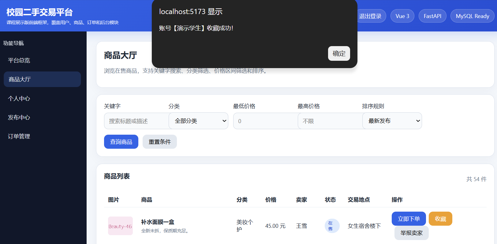 -->
商品大厅页面如下：
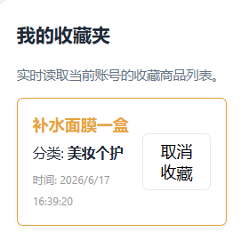
收藏后会有消息弹出提示：
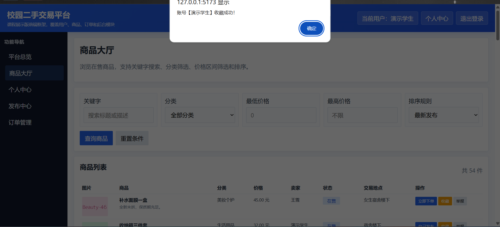
可自选商品大厅商品排序方式，按价格从低到高如下：
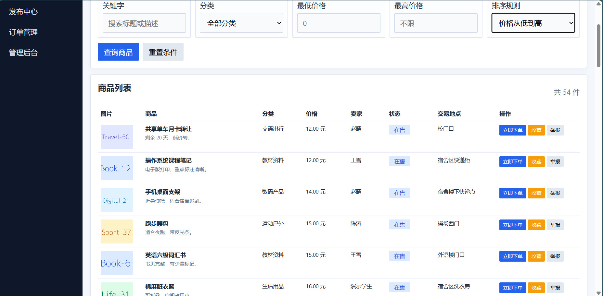
举报界面：
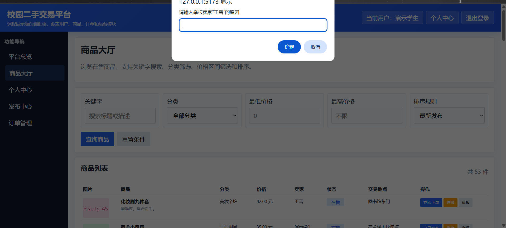

### 8.2 个人中心

可以在个人中心查看和修改个人基本信息：
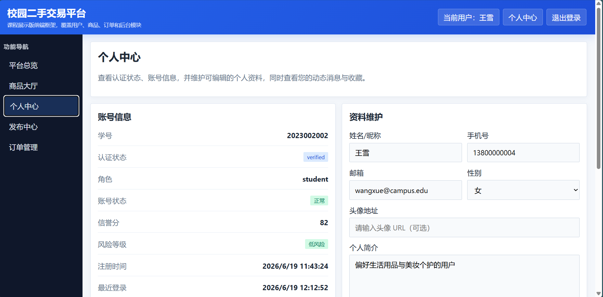

用户收藏商品后，可在个人中心查看收藏夹。收藏夹展示商品名称、分类和收藏时间，并支持取消收藏。

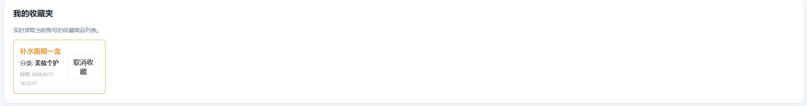

取消收藏后，收藏夹为空，系统能够即时反馈操作结果。

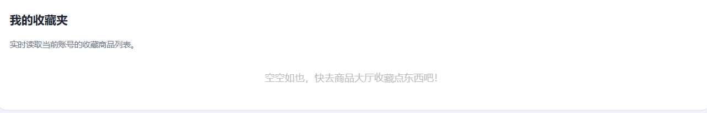

系统在订单和账号状态变化时生成站内通知。学生用户能够在个人中心看到买家下单提醒，管理员或相关用户能够看到订单确认等交易状态消息。

卖家消息提醒：
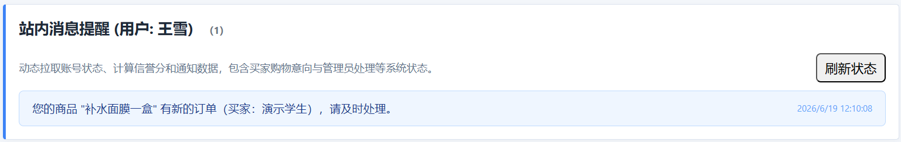
买家消息提醒：
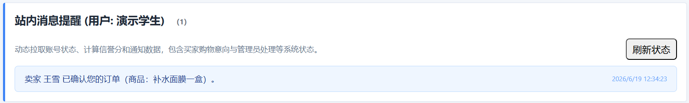

### 8.3 发布中心与商品管理

可以在发布中心发布商品，需在此处填写商品的详细信息，也可以在此处对分类进行管理，增加新的分类。
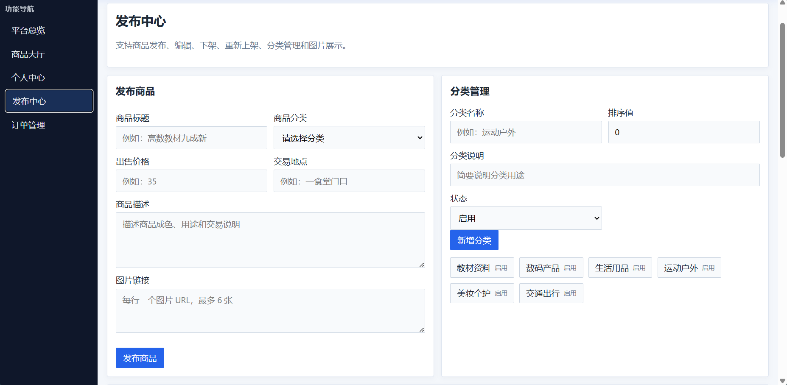
也可以在此处下架已发布的商品或对其进行编辑：
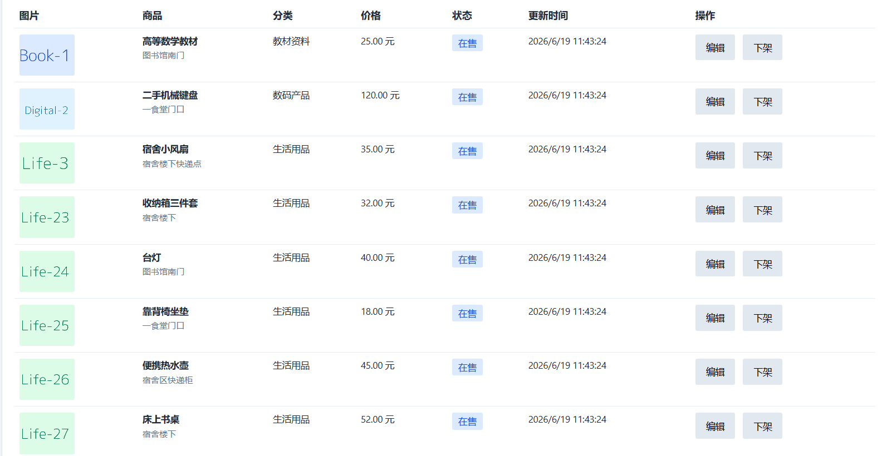

### 8.4 订单管理与订单评价
用户可以在此处进行订单的管理，卖家在此处确认订单：
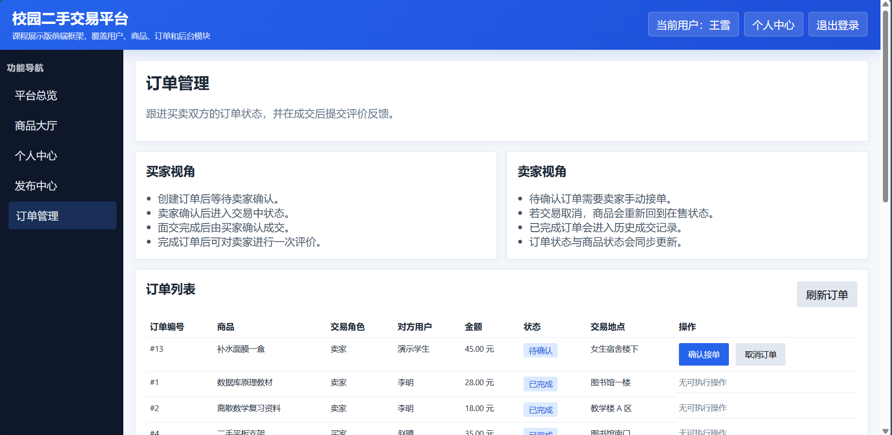
交易完成后买家在此处确认成交：
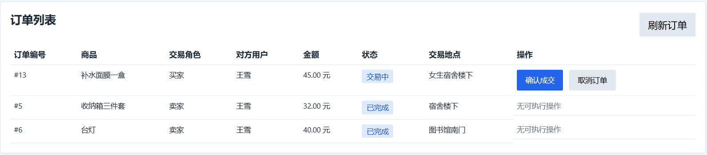
在过程中双方均可取消订单，但是如果在卖家确认接单之后取消订单的一方会扣除一定的信誉分。

买家可以在此处对已成交订单进行评价。
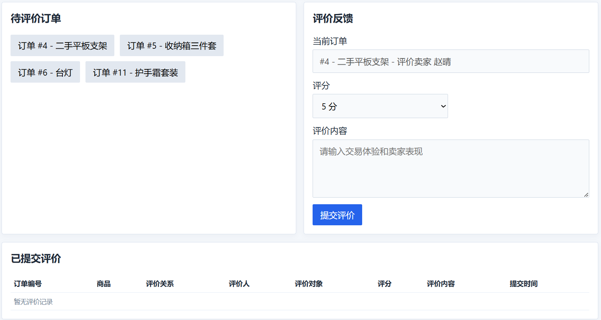

### 8.5 管理后台与用户评估

管理后台是管理员特有的功能分区。

热门商品类别排行、活跃用户排行在此处展示。
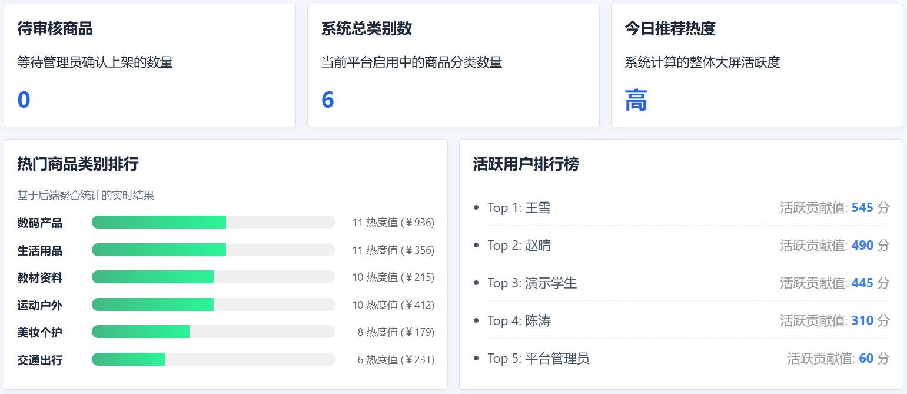
用户信用评估包括账号状态、信用等级、风险等级、计算分、责任取消率、卖家评分、举报次数和预警原因。
管理员可以视举报情况在此处拉黑用户：
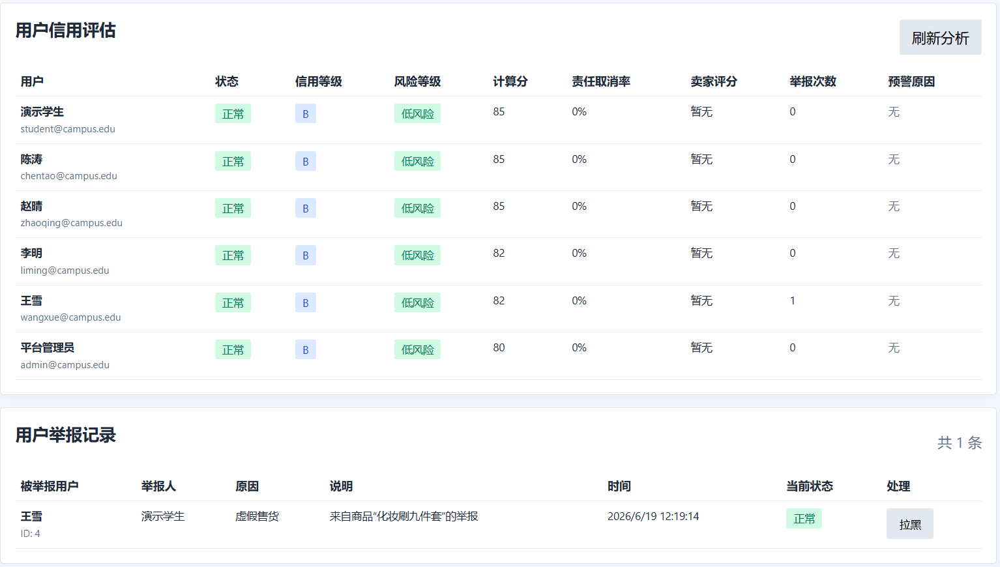
拉黑后信用评估处状态会改变，管理员也可以在此恢复用户账户
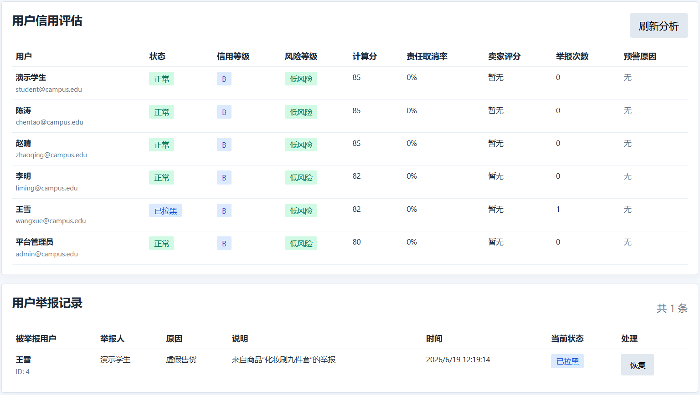
被拉黑用户如果此时在线，在个人中心处可以收到站内提醒，且其账号功能将受到限制：
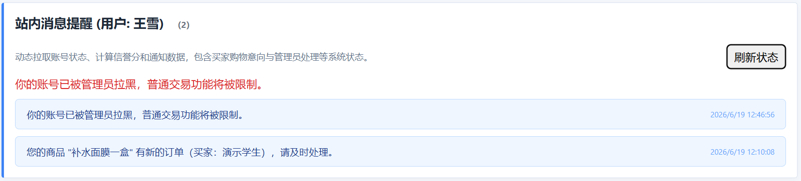

### 8.6 智能推荐演示说明

首页智能推荐中枢展示推荐模型名称、用户偏好摘要、推荐商品、AI 推荐分、推荐理由和推荐标签。登录用户浏览、收藏或下单后，系统会根据新增行为数据调整推荐结果。

首页概览：
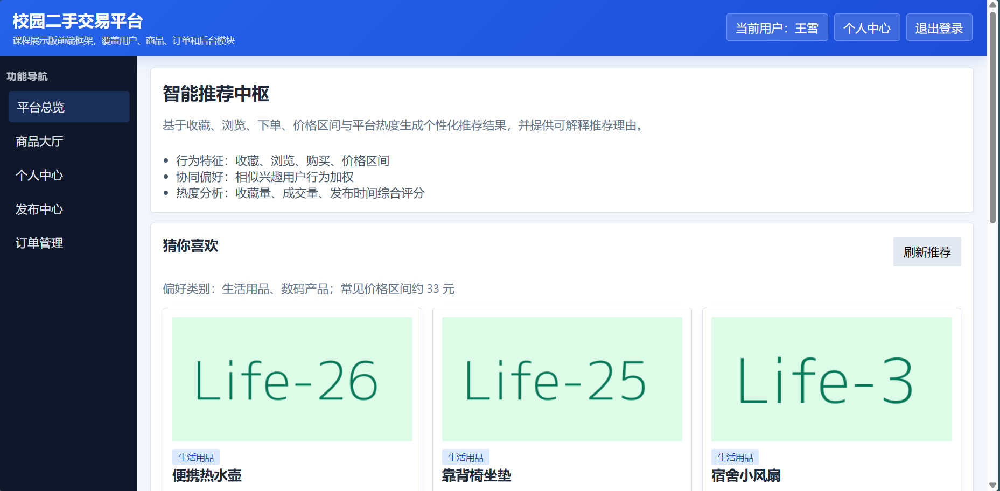
推荐详情：
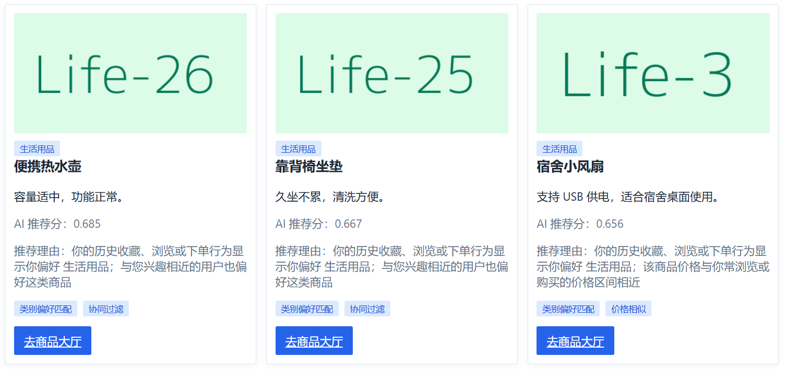

未登录用户则展示基于平台热度的冷启动推荐：
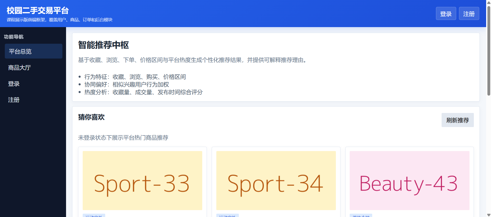
推荐详情：
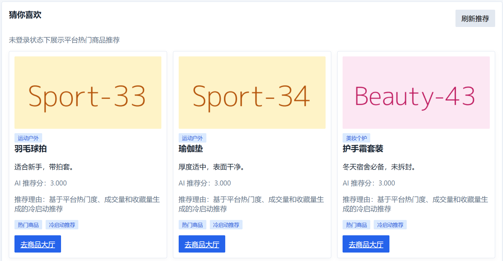

## 9. 测试与结果分析

系统通过接口测试验证主要业务流程，包括商品检索、商品发布、分类维护、收藏通知、智能推荐和社交行为等。测试重点覆盖以下内容：

- 商品列表是否支持关键字、分类、价格区间和排序筛选。
- 商品发布是否能够正确保存分类和图片信息。
- 卖家是否只能管理自己发布的商品。
- 收藏功能是否能够防止重复收藏和收藏自己商品。
- 推荐接口是否能够返回推荐算法名称、用户画像摘要、AI 推荐分和推荐理由。
- 浏览记录是否能够写入并作为推荐行为样本。
- 后台统计和信用评估是否能够基于数据库真实数据生成结果。

当前项目已通过推荐、商品和社交模块的核心测试，验证了数据库写入、查询筛选、权限约束和响应结构的正确性。结合前端演示截图，系统已经具备可展示、可运行、可说明的课程提交基础。

## 10. 小组成员分工与完成情况

| 成员 | 学号 | 分工 |
| --- | --- | --- |
| 陈卓妍 | 523030910037 | 用户注册、登录、身份认证和个人信息维护；订单创建、状态流转、成交确认和评价反馈；智能推荐；UI设计 |
| 左韵和 | 523030910035 | 商品收藏、购物意向记录和实时站内消息提醒；后台统计分析，如热门商品类别、活跃用户、成交金额趋势等 |
| 王乐凡 | 523030910036 | 商品发布、编辑、下架、分类管理；关键字搜索、按分类筛选、按价格区间筛选和排序；举报拉黑；用户评估 |

## 11. 总结

本项目围绕校园二手交易场景，完成了一个具有实际应用意义的数据库管理系统。系统从需求分析出发，建立了较完整的概念模型、关系模型和物理数据库设计，并实现了用户管理、商品管理、订单评价、收藏通知、后台统计、智能推荐和智能用户评估等功能。系统通过外码约束、索引设计、状态流转和聚合统计体现了数据库课程的核心知识点。

与普通信息管理系统相比，本项目进一步突出数据分析价值：智能商品推荐模块将用户行为数据转化为个性化推荐结果，智能用户评估模块将交易、评价和举报数据转化为信用等级和风险提示。这两个创新点增强了系统的实用性和答辩展示价值，也体现了数据库系统在智能化应用中的基础作用。

## 附录 A：建议提交材料清单

- 大作业报告文档：包含需求分析、概念设计、逻辑设计、物理设计、模块说明、创新点、截图和分工说明。
- 流程图与设计图：包含数据流图、E-R 图、系统结构图和业务流程图。
- 源程序与 SQL 文件：包含前端、后端、数据库初始化脚本和测试文件。
- 系统演示截图：包含商品大厅、收藏夹、站内通知、后台统计、用户信用评估和智能推荐页面。
- PPT：重点展示项目背景、数据库设计、核心模块、创新点和系统演示结果。
