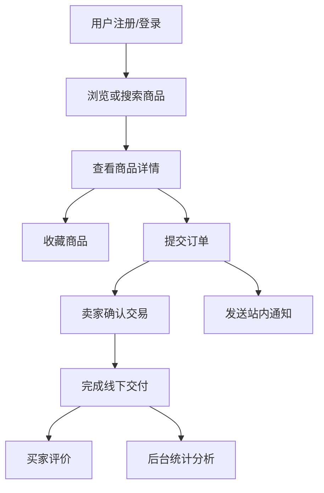

# 校园二手交易平台数据库管理系统大作业报告

## 1. 项目概述

### 1.1 选题名称
校园二手交易平台数据库管理系统

### 1.2 选题背景
高校中存在大量闲置物品，如教材、数码产品、自行车、生活用品等。传统的微信群、QQ群和朋友圈交易方式存在信息分散、发布混乱、搜索效率低、交易记录不可追踪、信用机制薄弱等问题。因此，设计一个面向校园场景的二手交易平台数据库管理系统，既能满足真实应用需求，又能够完整体现数据库课程中需求分析、概念设计、逻辑设计、物理设计、SQL 编程和应用开发等核心内容。

### 1.3 选题理由
选择“校园二手交易平台”作为数据库主题，主要有以下优势：

- 业务场景明确，需求容易理解，方便完成需求分析与系统演示。
- 实体种类丰富，包括用户、商品、订单、收藏、评价、举报、消息等，适合做规范化的数据建模。
- 能够体现多表关联、事务处理、触发器、视图、存储过程、统计查询等数据库特色能力。
- 具备一定创新空间，可加入商品推荐、热度分析、异常交易识别等智能分析模块。
- 工作量适中，适合 3 至 4 人小组协同完成。

## 2. 需求分析

### 2.1 目标用户

- 学生卖家：发布闲置商品、管理库存、与买家沟通、处理订单。
- 学生买家：浏览商品、搜索筛选、收藏商品、下单交易、评价卖家。
- 管理员：审核商品、处理举报、维护用户信用、查看平台运营数据。

### 2.2 业务需求

系统需要满足以下基本应用需求：

1. 支持用户注册、登录、身份认证和个人信息维护。
2. 支持商品发布、编辑、下架、分类管理和图片展示。
3. 支持关键字搜索、按分类筛选、按价格区间筛选和排序。
4. 支持商品收藏、浏览记录采集、购物意向记录和站内消息提醒。
5. 支持订单创建、状态流转、成交确认和评价反馈。
6. 支持智能商品推荐与统计分析，如热门商品类别、活跃用户、成交金额趋势等。

### 2.3 非功能需求

- 易用性：界面简洁，适合网页端快速演示。
- 安全性：防止 SQL 注入，控制不同角色权限，保护隐私信息。
- 可维护性：数据库结构规范，命名统一，方便后续扩展。
- 可扩展性：已支持推荐分析，后续仍可继续增加聊天、信誉评分和异常交易识别等功能。
- 性能要求：支持中等规模数据量下的常见查询与统计。

## 3. 本领域研究现状分析

### 3.1 现有方案特点
目前常见的二手交易平台包括闲鱼、转转以及各高校内部的微信群、贴吧、校园论坛等。它们普遍具备商品发布、信息检索、沟通联系、订单管理等功能，但在校园内部场景中存在若干不足：

- 社交平台以消息流为主，不适合作为结构化交易数据库系统。
- 通用二手平台更注重全国范围交易，缺少“同校认证”“面对面交易”“宿舍自提”等校园特性。
- 非正式渠道缺乏可信的信用约束，难以保存结构化交易记录。
- 很多平台的演示重点在前端交互，数据库设计与管理功能不够突出。

### 3.2 本项目与现有方案的差异
本项目以数据库课程实践为核心，强调“数据组织与管理能力”，重点不是做一个完整商业产品，而是通过一个真实业务场景展示数据库设计方法和实现能力。相比通用平台，本方案更突出：

- 基于校园认证的用户管理机制。
- 面向课程展示的规范化 E-R 建模和关系模式设计。
- 对交易过程、举报审核、用户信用等数据流程进行完整建模。
- 引入 SQL 统计分析与推荐逻辑，体现数据库高级应用能力。

## 4. 系统总体方案设计

### 4.1 系统目标
构建一个面向校园内部的二手交易数据库管理系统，实现“用户管理、商品管理、交易管理、评价反馈、智能推荐、数据分析”六大核心能力。

### 4.2 技术路线

- 前端：Vue 3 + Vue Router + Axios
- 后端：FastAPI + SQLAlchemy
- 数据库：MySQL 8.0
- 测试：pytest
- 部署与初始化：Docker Compose 启动 MySQL，前后端本地开发运行

本项目当前采用“前后端分离 + MySQL 数据库”方案，兼顾课程展示效果与数据库实现深度。

### 4.3 系统架构

系统可划分为四层：

1. 表示层：提供登录页、商品列表页、商品详情页、个人中心页、管理后台页等界面。
2. 业务逻辑层：处理注册登录、商品审核、订单状态流转、评价计算、举报处理等业务规则。
3. 数据访问层：负责 SQL 编写、事务控制、视图与存储过程调用。
4. 数据存储层：MySQL 数据库，保存结构化业务数据与统计结果。

### 4.4 业务流程

核心业务流程如下：

1. 用户注册并完成校园身份认证。
2. 卖家发布商品，填写名称、分类、价格、描述、交易地点等信息。
3. 商品发布后进入在售状态，可由卖家后续下架或重新上架。
4. 买家浏览并搜索商品，查看详情后收藏或下单。
5. 双方线下交易或约定交付，卖家确认成交。
6. 订单完成后，买家可进行评价，系统同步更新卖家信誉分。
7. 用户可收藏商品，系统同步记录浏览轨迹；买家下单后系统会向卖家发送站内通知。
8. 首页“猜你喜欢”模块基于用户收藏、浏览、下单、价格偏好和商品热度生成个性化推荐，并输出推荐理由。
9. 管理员在后台查看热门类别、活跃用户和成交趋势等统计信息。

### 4.5 流程图



## 5. 功能模块设计

### 5.1 用户管理模块

- 用户注册、登录、退出。
- 校园邮箱或学号认证。
- 个人资料维护。
- 信誉分展示与历史交易查询。

### 5.2 商品管理模块

- 商品发布、修改、删除、下架。
- 商品分类管理。
- 商品状态维护：待审核、在售、已预订、已售出、已下架。
- 商品图片与描述信息管理。

### 5.3 交易订单模块

- 创建订单。
- 记录交易时间、金额、交易地点、支付方式。
- 订单状态流转：待确认、交易中、已完成、已取消。
- 事务控制，确保商品状态与订单状态一致。

### 5.4 收藏与智能推荐模块

- 用户收藏商品，收藏结果写入 `favorite` 表。
- 用户浏览商品列表时记录浏览轨迹，写入 `browse_history` 表。
- 下单或交互后可生成站内通知，写入 `notification` 表。
- 系统基于收藏、浏览、下单、类别偏好、价格区间和商品热度构建轻量级 AI 混合推荐模型。
- 推荐结果除商品列表外，还输出 `ai_score`、`ai_reason` 和 `ai_tags`，便于课程答辩时解释算法依据。
- 为首页推荐区、个人中心和后台看板提供行为数据支撑。

### 5.5 评价与举报模块

- 买家对卖家和商品进行评分与文字评价。
- 评价后动态调整卖家信用分。
- 当前仓库已预留后台治理入口，后续可继续扩展举报与异常治理模块。

### 5.6 数据分析模块

- 热门商品类别排行。
- 成交金额趋势统计。
- 活跃用户排行。
- 收藏和订单行为驱动的热度分析。
- 面向首页“猜你喜欢”的智能推荐分析。

## 6. 数据库设计

### 6.1 主要实体

本系统当前已实现并实际落库的主要实体包括：

- 用户（User）
- 商品分类（Category）
- 商品（Product）
- 商品图片（ProductImage）
- 订单（Order）
- 收藏（Favorite）
- 评价（Review）
- 通知（Notification）
- 浏览记录（BrowseHistory）

说明：

- 举报、管理员处理记录等扩展实体已在需求分析与后续规划中考虑，当前版本重点先完成推荐所需的浏览记录表落地。

### 6.2 E-R 关系说明

1. 一个用户可以发布多个商品。
2. 一个商品属于一个分类，但一个分类下可以有多个商品。
3. 一个用户可以收藏多个商品，一个商品也可被多个用户收藏，属于多对多关系。
4. 一个商品在交易成功后对应一个或多个历史订单记录。
5. 一个订单关联一个买家、一个卖家和一个商品。
6. 一个订单完成后可产生一条评价记录。
7. 收藏、通知和评价等行为均与用户、商品和订单建立结构化关联。
8. 浏览记录与收藏、订单共同构成推荐分析的行为样本。

### 6.3 关系模式设计

当前版本的核心数据表如下：

1. `user(user_id, student_no, user_name, gender, phone, email, password_hash, role, credit_score, status, verify_status, avatar_url, bio, create_time, update_time, last_login_time)`
2. `category(category_id, category_name, description, sort_order, status, create_time, update_time)`
3. `product(product_id, seller_id, category_id, title, description, price, trade_location, status, publish_time, update_time)`
4. `product_image(image_id, product_id, image_url, sort_order)`
5. `favorite(favorite_id, user_id, product_id, create_time)`
6. `order_info(order_id, product_id, buyer_id, seller_id, order_amount, order_status, trade_method, trade_location, buyer_note, cancel_reason, create_time, update_time, finish_time)`
7. `review(review_id, order_id, reviewer_id, reviewed_user_id, score, content, create_time)`
8. `notification(notification_id, receiver_id, content, create_time)`
9. `browse_history(history_id, user_id, product_id, browse_time)`

### 6.4 规范化说明

- 各表主键单一明确，满足第一范式。
- 非主属性完全依赖主键，满足第二范式。
- 尽量避免传递依赖，例如商品通过 `category_id` 外键关联分类表，而不是直接存储分类名称。
- 对高频业务字段如 `credit_score` 采用直接维护，减少统计汇总时的重复计算开销。

### 6.5 索引设计

建议建立以下索引：

- `user(student_no)` 唯一索引。
- `user(email)` 唯一索引。
- `product(category_id, status)` 联合索引。
- `product(price)` 普通索引。
- `order_info(buyer_id, order_status)` 联合索引。
- `review(reviewed_user_id)` 索引。
- `favorite(user_id, product_id)` 唯一索引。
- `notification(receiver_id)` 索引。
- `browse_history(user_id)`、`browse_history(product_id)` 索引。

### 6.6 视图、触发器与存储过程设计

当前版本重点通过后端服务层和 SQL 聚合查询体现数据库高级应用能力，已落地内容包括：

1. 收藏、通知、统计等功能统一接入数据库并通过接口提供服务。
2. 订单完成时同步更新 `order_info` 与 `product` 状态，体现事务型数据一致性。
3. 评价提交后同步更新卖家 `credit_score`，体现业务规则驱动的数据维护。
4. 后台统计直接基于 `product`、`favorite`、`order_info` 和 `user` 聚合生成。
5. 推荐模块通过 `favorite`、`browse_history`、`order_info` 和 `product` 进行多表联动分析，生成可解释推荐结果。

后续仍可继续扩展：

- 热门商品视图
- 用户信用汇总视图
- 订单状态触发器
- 类别销量存储过程

## 7. 关键 SQL 与数据库实现重点

### 7.1 商品查询示例

```sql
SELECT p.product_id, p.title, p.price, c.category_name, u.user_name
FROM product p
JOIN category c ON p.category_id = c.category_id
JOIN user u ON p.seller_id = u.user_id
WHERE p.status = 'ON_SALE'
  AND p.category_id = 1
ORDER BY p.publish_time DESC;
```

### 7.2 热门商品统计示例

```sql
SELECT c.category_id,
       c.category_name,
       COUNT(DISTINCT p.product_id) AS pub_count,
       COUNT(f.favorite_id) AS fav_count,
       COALESCE(SUM(DISTINCT p.price), 0) AS total_revenue
FROM category c
LEFT JOIN product p ON p.category_id = c.category_id
LEFT JOIN favorite f ON f.product_id = p.product_id
GROUP BY c.category_id, c.category_name
ORDER BY pub_count + fav_count DESC;
```

### 7.3 事务处理重点

- 创建订单时，需要同时检查商品状态、写入订单、锁定商品。
- 订单完成时，需要同步更新订单状态和商品状态。
- 用户评价时，需要同时写入评价记录并更新卖家信誉分。
- 发送站内提醒时，需要将通知写入 `notification` 表，供卖家后续查看。
- 记录浏览行为时，需要校验商品存在性，再写入 `browse_history` 表，为推荐模块提供有效样本。

### 7.4 智能推荐分析实现

本项目在数据库大作业基础功能之上，增加了一个“轻量级 AI 混合推荐模块”，用于在首页生成“猜你喜欢”。该模块不依赖外部大模型服务，而是使用本地数据库中的行为数据完成可解释分析，更适合作为课程项目展示。

推荐得分主要由四部分构成：

1. 类别偏好分：若用户收藏、浏览、下单过某一类商品，则同类商品获得更高权重。
2. 价格相似分：根据用户历史行为中的价格样本，优先推荐相近价格区间商品。
3. 热度分：收藏量和已完成订单量越高，商品热度越高。
4. 协同偏好分：使用用户类别行为向量计算兴趣相似度，再参考相似用户偏好的商品。

系统对每个候选商品输出 `ai_score`、推荐理由和标签，例如“类别偏好匹配”“价格相似”“热门商品”“协同过滤”，从而把推荐结果包装为具备解释性的 AI 分析功能。

## 8. 创新点设计

为突出课程作业亮点，本项目已经实现并可演示以下创新点：

### 8.1 轻量级 AI 智能推荐
基于 `favorite`、`browse_history`、`order_info` 三类用户行为数据，结合商品类别、价格区间和平台热度，实现“类别偏好 + 价格相似 + 热度分析 + 协同偏好”的混合推荐算法。相比单纯按时间排序或热门排序，该模块能够输出个性化结果，并给出可解释推荐原因，较好体现了数据库与智能分析技术结合的创新点。

### 8.2 热度统计与后台看板
基于商品发布数、收藏数和成交金额聚合生成后台统计看板，支持热门分类排行和平台热度展示。

### 8.3 用户信用评分
根据历史成交次数、评价得分、取消率、被举报次数等指标动态维护用户信用分，为管理员治理和用户决策提供依据。

### 8.4 收藏、浏览与站内通知联动
用户收藏商品、浏览商品、买家下单后，系统会写入收藏记录、浏览记录与站内通知，增强交易过程中的信息联动与可追踪性。

### 8.5 校园场景增强
加入“交易地点”“宿舍楼区域”“校区”字段，使数据库设计更贴近实际校园应用。

## 9. 系统界面设计说明

### 9.1 主要界面

1. 登录/注册界面：支持学号或邮箱登录。
2. 商品大厅界面：展示分类筛选、关键字检索、价格区间筛选、收藏与下单按钮。
3. 首页推荐界面：展示推荐模型名称、用户偏好摘要、AI 推荐分、推荐理由和标签。
4. 发布中心界面：展示商品发布、编辑、分类管理和图片链接录入。
5. 订单管理界面：展示订单流转、取消、完成和评价功能。
6. 个人中心界面：展示账号信息、资料维护、我的收藏、站内通知。
7. 管理后台界面：展示热门分类、活跃用户和整体运营热度。

### 9.2 演示截图建议

最终提交时，建议至少补充以下截图：

- 用户登录成功页面。
- 商品列表与搜索结果页面。
- 首页智能推荐页面。
- 商品发布页面。
- 订单创建与完成页面。
- 收藏与通知页面。
- 数据统计图表页面。

## 10. 小组分工建议

若为 4 人小组，可按照以下方式分工：

1. 成员 A：需求分析、E-R 图设计、关系模式设计、报告整合。
2. 成员 B：数据库建表、索引、SQL 初始化脚本、测试数据维护。
3. 成员 C：前端页面设计与交互实现，完成商品、订单、个人中心和后台界面。
4. 成员 D：后端接口、业务逻辑实现、收藏通知、统计分析与测试联调。

若为 3 人小组，可将“前端”和“后端联调”合并，由一名成员统筹。

## 11. 开发计划与实施步骤

### 11.1 第一阶段：需求与建模

- 明确业务场景与用户角色。
- 完成需求分析与同类系统调研。
- 绘制 E-R 图并设计数据表。

### 11.2 第二阶段：数据库实现

- 创建数据库与数据表。
- 编写主键、外键、索引、视图、触发器和存储过程。
- 准备测试数据并进行 SQL 调试。

### 11.3 第三阶段：应用开发

- 完成登录、商品、订单、评价、举报等核心页面。
- 打通前后端与数据库。
- 完成典型业务流程演示。

### 11.4 第四阶段：总结与答辩准备

- 整理实验结果与截图。
- 汇总成员分工与完成情况。
- 提炼创新点，制作重点突出的 PPT。

## 12. 可交付成果清单

根据课程要求，本项目最终可提交以下成果：

1. 大作业报告文档：包含需求分析、研究现状、总体设计、模块说明、创新点、截图、分工说明。
2. 源程序与 SQL 文件：包括前端代码、后端代码、建表语句、视图、触发器、存储过程、测试数据脚本。
3. 流程图与数据库设计图：包括业务流程图、E-R 图、系统架构图。
4. PPT：突出问题背景、系统方案、数据库设计、创新点、演示效果。

## 13. 风险与应对

- 风险 1：功能做得过多，导致后期难以完成。
  应对：优先完成“用户、商品、订单、评价、收藏通知、后台统计”核心模块。
- 风险 2：前端开发耗时过长，影响数据库重点展示。
  应对：界面采用简洁模板，把更多时间投入数据库实现。
- 风险 3：组员工作分配不均。
  应对：每人负责一个可验收模块，并在报告中列出实际完成内容。

## 14. 总结

“校园二手交易平台数据库管理系统”兼具真实性、可实现性与课程展示价值。当前版本已经完成了用户、商品、订单、评价、收藏通知和后台统计等核心闭环，能够较完整地覆盖数据库系统开发中的需求分析、关系模式设计、外键建模、SQL 聚合、事务控制、索引优化与接口测试等关键知识点，适合作为可演示、可答辩、可提交的数据库大作业成果。

## 15. 商品管理与检索功能补充过程报告

### 15.1 补充目标

根据系统既有内容，本次补充重点落实需求分析中的两个核心功能：

1. 支持商品发布、编辑、下架、分类管理和图片展示。
2. 支持关键字搜索、按分类筛选、按价格区间筛选和排序。

补充范围覆盖数据库模型、后端接口、前端页面、初始化 SQL 与接口测试，保证功能可以在课程演示中形成完整闭环。

### 15.2 数据库与模型调整

原系统已有 `product` 表，当前版本进一步调整为通过 `category_id` 外键关联分类表，并在此基础上新增两类数据对象：

- `category`：保存分类名称、说明、排序值、启用状态、创建时间和更新时间，用于支撑分类管理。
- `product_image`：保存商品图片 URL、所属商品和排序值，用于支撑多图展示。

同时为 `product` 表补充了更符合查询场景的索引设计：

- `idx_product_category_status(category_id, status)`：提升按分类和在售状态筛选的效率。
- `idx_product_price(price)`：提升价格区间筛选和价格排序的效率。
- `idx_product_status(status)`：用于商品大厅只展示在售商品、发布中心展示商品状态。

初始化脚本 `database/mysql/init/01_auth_user.sql` 已同步创建 `category` 和 `product_image` 表，并将 `product.category_id` 设计为外键；`04_my_task_tables.sql` 已提供 `favorite` 和 `notification` 表结构。

### 15.3 后端接口实现

后端沿用 FastAPI + SQLAlchemy 的既有分层方式，在 `product_service.py` 中集中实现商品业务逻辑，在 `products.py` 中暴露商品与分类 API；同时在 `social.py` 中提供收藏、通知接口，在 `admin.py` 中提供后台统计接口。

本次新增或增强的接口如下：

| 接口 | 方法 | 功能 |
| --- | --- | --- |
| `/api/products` | GET | 商品大厅列表，支持关键字、分类 ID、价格区间、排序查询 |
| `/api/products` | POST | 登录用户发布商品，支持图片 URL 列表 |
| `/api/products/mine` | GET | 查询当前用户发布的全部商品 |
| `/api/products/{product_id}` | PUT | 卖家编辑自己发布的商品 |
| `/api/products/{product_id}/offline` | PATCH | 卖家下架自己的在售商品 |
| `/api/products/{product_id}/relist` | PATCH | 卖家重新上架已下架商品 |
| `/api/products/categories` | GET | 查询分类列表 |
| `/api/products/categories` | POST | 新增商品分类 |
| `/api/products/categories/{category_id}` | PUT | 编辑分类信息与启用状态 |
| `/api/favorites` | GET/POST | 查询或新增当前用户收藏 |
| `/api/notifications` | GET/POST | 查询或发送站内通知 |
| `/api/admin/dashboard` | GET | 获取后台统计数据 |

关键业务规则如下：

- 商品发布与编辑时要求传入合法的 `category_id`，并校验分类是否存在且处于启用状态。
- 商品编辑、下架、重新上架均要求当前登录用户是商品卖家。
- 已锁定或已售出的商品不能编辑；已锁定商品不能下架；已售出商品不能下架。
- 商品大厅默认只展示 `ON_SALE` 状态商品，避免买家看到已下架或已售出的商品。
- 价格区间查询会校验最低价格不能高于最高价格。
- 买家收藏商品时不能收藏自己发布的商品，也不能重复收藏。
- 买家下单后可向卖家发送站内通知，卖家可在个人中心查看通知记录。

### 15.4 前端页面实现

前端沿用 Vue 3 + Axios + Vue Router 的既有结构，重点打通了商品大厅、发布中心、个人中心和后台统计页面。

1. 商品大厅 `ProductsView.vue`

- 新增关键字输入框，支持按商品标题和描述检索。
- 新增分类下拉框，分类数据来自后端分类接口，并按 `category_id` 提交筛选条件。
- 新增最低价格、最高价格筛选条件。
- 新增排序字段与排序方式选择，支持按发布时间或价格升降序排列。
- 商品表格新增图片缩略图列，优先展示商品第一张图片。
- 保留原有“立即下单”流程，并在下单后向卖家发送站内通知。
- 收藏功能已经改为通过正式 `/api/favorites` 接口接入鉴权体系。

2. 发布中心 `PublishView.vue`

- 新增可提交的商品发布表单，字段包括标题、分类、价格、地点、描述和图片 URL。
- 支持编辑“我发布的商品”，表单会自动回填已有商品信息。
- 支持在售商品下架、已下架商品重新上架。
- 增加“我发布的商品”列表，展示图片、分类、价格、状态和更新时间。
- 增加分类管理区，支持新增分类、编辑分类名称、说明、排序值和启用状态。

3. 个人中心与后台页面

- 个人中心支持查看当前账号收藏记录与站内通知。
- 后台页面通过 `/api/admin/dashboard` 获取真实统计结果，展示热门分类、活跃用户和整体热度。

样式文件 `styles.css` 已补充商品缩略图、筛选网格、图片预览、分类标签、小屏表格滚动等样式，保证新增内容在桌面端和窄屏下均可演示。

### 15.5 测试与验证

新增测试文件 `backend/tests/test_product_api.py`，覆盖以下场景：

- 商品列表支持关键字搜索、分类筛选、价格区间筛选、价格排序，并返回商品图片。
- 发布商品时能保存分类和图片 URL。
- 卖家可以编辑并下架自己发布的商品。
- 非卖家不能管理他人商品。
- 分类可以新增和编辑。

同时，新增 `backend/tests/test_recommendation_api.py`，覆盖游客冷启动推荐、登录用户个性化推荐和浏览记录写入；`backend/tests/test_social_api.py` 覆盖收藏通知接口等关键流程。当前针对推荐、商品和社交接口的测试结果为 `13 passed`。

测试重点验证数据库写入、接口权限、业务状态流转和响应数据结构，能够支撑本次功能在答辩演示中的可靠性。

### 15.6 实现效果说明

本次补充后，系统不仅完成了商品信息管理与检索闭环，还加入了首页“猜你喜欢”智能推荐模块。卖家可以完成“维护分类 -> 发布商品 -> 展示图片 -> 编辑商品 -> 下架/上架”的闭环；买家可以完成“关键字搜索 -> 分类筛选 -> 价格筛选 -> 排序浏览 -> 收藏/下单 -> 触发推荐”的闭环；管理员可以在后台看到真实统计结果。

从数据库课程角度看，该补充体现了以下能力：

- 通过分类表、图片表、收藏表、浏览记录表和通知表增强数据规范化与扩展性。
- 通过索引支持高频查询条件。
- 通过后端服务层封装权限校验和状态规则。
- 通过接口测试验证数据一致性、业务约束和鉴权逻辑。

---

## 附录 A：建议补充的图表

- 系统架构图
- E-R 图
- 数据表结构截图
- 关键 SQL 运行结果截图
- 系统页面截图
- 数据统计图表截图

## 附录 B：答辩时可强调的亮点

- 校园场景贴近真实需求，不是纯理论题目。
- 数据表关系清晰，能展示较完整的数据库设计能力。
- 包含索引、视图、触发器、存储过程等高级特性。
- 增加推荐、信用分、异常识别等分析能力，体现创新性。
